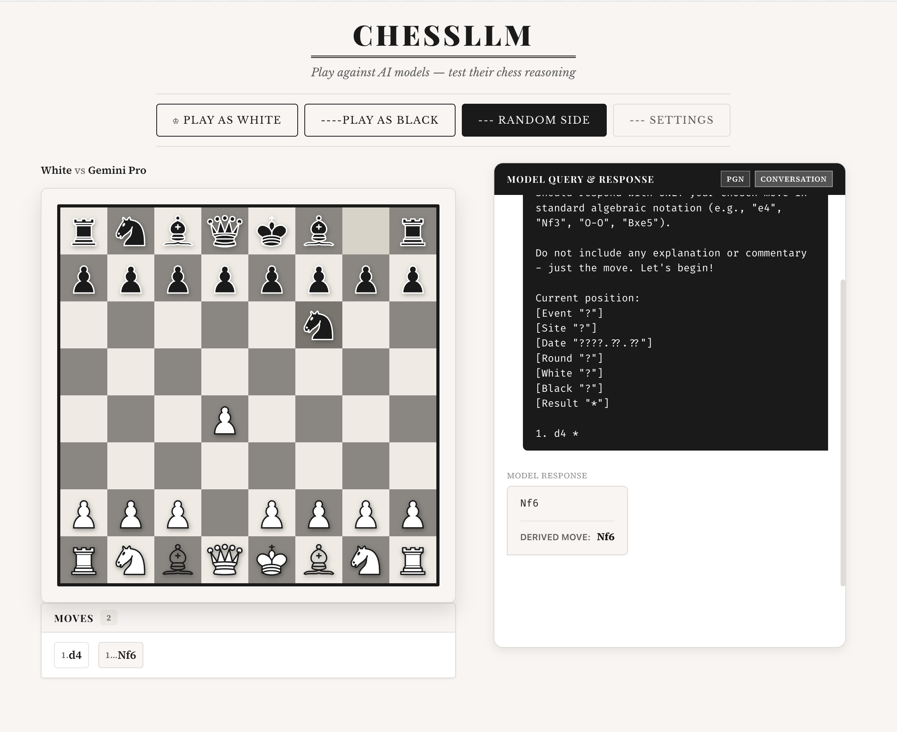
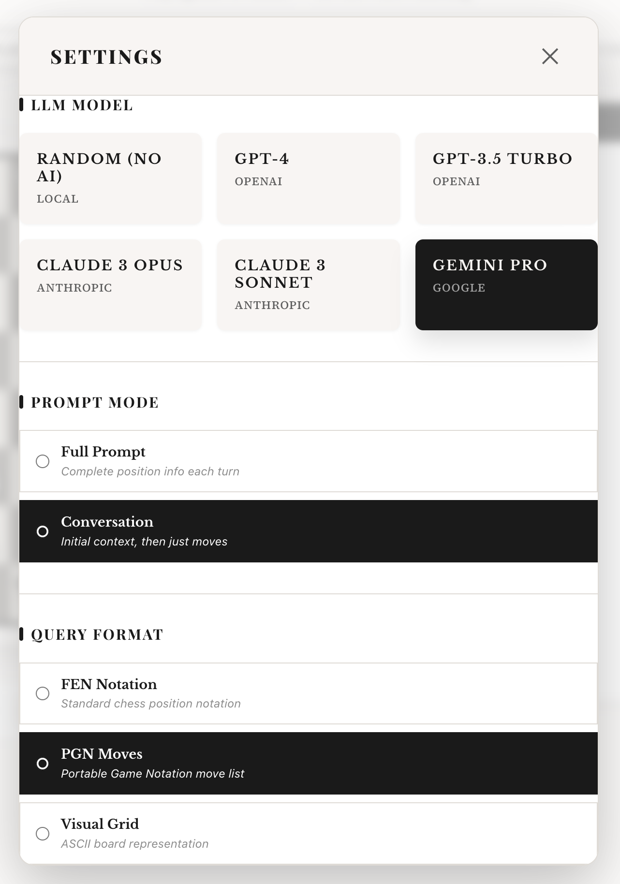
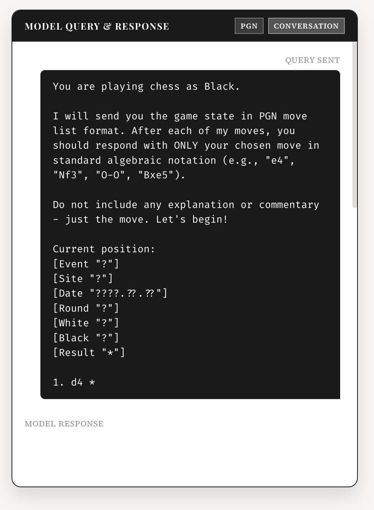

# ChessLLM 

ChessLLM is a custom react front end to enable playing against LLM models.

Creates a conversation with LLM's using your own API key (define in keys.json at root) and uses some regex to derive moves.


## To Run: 
```npm install ```

```npm run dev```


## Description:


It's fun because LLM's play whacky moves that make no sense.

Wraps Chess.js to allow illegal moves.

Note: Gemini pro free tier is too low to complete most games


### screenshots:


#### support for most free-tier llm services


#### Several conversation modes 
